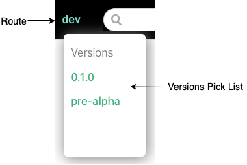

# {{$frontmatter.title}}

<TocHeader />
[[toc]]

All versions of the docs are inside the api3-docs repo. Versioning of the docs is not implemented using traditional tags in a GitHub repo. This allows all versions to be available while using the docs. It also allows older versions to be updated independently of any other version including _"next"_.

## Understand Versions

Different versions of the documentation live in the project's api3-docs/docs folder.

```text
docs/
 |- 0.1.0/
 |- dev
 |- next/
 |- pre-alpha/
```

### Declaring Versions

A folder in **/docs** is declared as a version in the .vuepress/config.json file (versions key) along with its *url* (entry path). The versions are used to populate the versions pick-list in the navbar. 

```json
versions:[
  {name:'next', url:'/next/'},
  {name:'0.1.0', url:'/0.1.0/'},
  {name:'pre-alpha', url:'/pre-alpha/'},
],
```

Note that the folder **/dev** is not declared as a version and as such is just another route on the documentation website. It will not appear in the versions pick-list.

  > 

### next

The **/next** folder is a _working/future_ version. It is never shown in the production website on gh-pages but is shown in development. The next release can be accessed in production by changing the browser URL to **.../api3-doc/next/**.

### dev

The **/dev** folder is just another route. It is never shown in the version pick list, production or development. The dev release can be accessed at **.../api3-doc/dev/**.

## Create a Version

It is assumed that the **next** folder is the work in progress that will become the new version.

1. Make a copy of the **next** folder and name it (e.g. 0.2.0).

1. Update the **versions** key in .vuepress/config.json. Provide the version name and url. The url is the first markdown file to show when a version is selected in the navbar. A url without a file will load the root README.md by default.

    ```json
    versions:[
      {name:'next', url:'/next/'},
      {name:'0.2.0', url:'/0.2.0/'},
      {name:'0.1.0', url:'/0.1.0/'},
      {name:'pre-alpha', url:'/pre-alpha/'},
      ...
    ],
    ```

1. The **next** version probably contained hyperlinks to remote GitHub repos. More than likely these link will need updating in the version just created.

## Update Older Versions

Older versions can be updated at any time, even will work progresses on the **next** version. It should be noted that such updates will not be reflected in the next or any other version, if needed they must be added separately.
