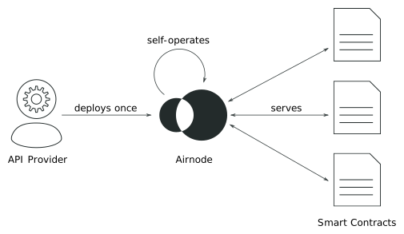

# {{$frontmatter.title}}

<TocHeader />
[[TOC]]

Airnode is a fully-serverless oracle node that is designed specifically for API providers
to operate their own oracles.

::: danger TODO
Airnode: describe its relationship to dAPI. ??? As part of the dAPI eco-system...  Define dAPI: "a decentralized API (dAPI) network" with components such as Airnode. “API3’s organizational DAO structure provides a framework for truly decentralized on-chain data feeds, which the team calls dAPIs.”
:::

One way to see Airnode is as a lightweight wrapper around a Web API that allows it to communicate with smart contract platforms with no overhead or payment token friction. Regarding the level of involvement required from an API Provider, using Airnode can be likened to utilizing an API gateway that makes an API accessible over the Web, rather than operating a blockchain node as a side-business. The goal is for Airnode to become as ubiquitous and mundane as possible for First-Party Oracles.

## How it Works

::: danger TODO
This section needs work.
:::

The following is a high-level summary of how Airnode works.

1. A client smart contract makes a call to the Airnode protocol smart contract to make a request a specific Airnode.
2. Airnode uses blockchain providers (such as Pocket Network or a self-operated node) to detect incoming requests. Airnode is off-chain and is hosted in a Cloud Provider such as AWS. ~~(I think this second sentence is out of place here because 1-2-3 describes the process while it describes the properties of Airnode.)~~
3. Airnode makes a request to its owner's API.