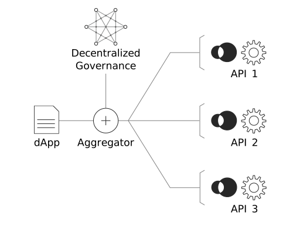

# {{$frontmatter.title}}

<TocHeader />
[[TOC]]

Consider the following points previously discussed.

* Decentralized applications need access to [APIs](./apis.md).
* APIs should be interfaced to smart contract platforms through [First-Party Oracles](./first-party-oracles.md).
* For API level decentralization, [Decentrally-Governed Oracle Networks](./decentrally-governed-oracle-networks.md) should be employed.

We can conclude that Decentrally-Governed Oracle Networks of First-Party Oracles solve the API connectivity problem. Although this is technically correct, the same solution can be reached through a more useful lens.

Decentralized applications cannot access Web APIs, and Oracle solutions aim to build decentralized interfaces to facilitate this. However, this approach results in an inferior solution and ecosystem (see the <a href="../../api3-whitepaper.pdf" target="_whitepaper_pdf">API3 Whitepaper</a>) for a detailed explanation).

Instead, API3 will build complete products called decentralized APIs (dAPIs for short), which are blockchain-native, decentralized API services. From the user's (i.e., the entity that operates the decentralized application) perspective, the experience of using a dAPI would be very similar to a Web developer using a traditional API; they would find a dAPI they need, pay the subscription fee, and enjoy access.

Due to being defined as a full product rather than an interface, unlike a traditional oracle network, a dAPI includes the underlying APIs. This results in a superior solution (secure and cost-efficient First-Party Oracles) and ecosystem (with API providers as its members).
