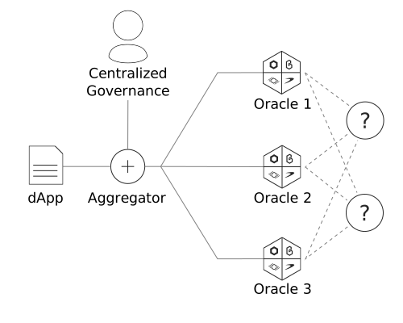

# {{$frontmatter.title}}

[[TOC]]

<Version selectedVersion="next" />

Table of Contents

*See the article, [On DAOs: Decentralized Autonomous Organizations](https://medium.com/api3/on-daos-decentralized-autonomous-organizations-84c00abb89bc) about DAOs and decentralized governance.*

[First-Party Oracles](first-party-oracles.md) are optimally secure and cost-efficient.
Nevertheless, they cannot be considered as a full solution for all use cases.
This is because a First-Party Oracle is operated by a single API Provider and only serves their API.
Thus, using a single First-Party Oracle creates centralization at the API level, and requires the API Provider to be trusted. This is not acceptable in some use cases, e.g., if the use case secures a large amount of funds.

In such cases, Oracle Networks provide the required decentralization. An Oracle Network makes the same request to multiple independent oracles and reduces their responses to a single answer through predetermined consensus rules implemented as a smart contract called the aggregator.
Individual malicious oracles cannot manipulate the outcome of this process, which provides a degree of decentralization and trustlessness.

## Centralized Governance

An important thing to consider is how the oracle Network is governed. If a central entity can switch the oracles or APIs used in the aggregator in and out, or even replace the aggregator itself making use of a proxy mechanism, they can effectively manipulate the Oracle Network output at will. This eliminates the decentralization and trustlessness qualities that using an Oracle Network provides.

## Decentralized Governance

It is not adequate to use an Oracle Network just for decentralization, the Oracle Network must be governed decentrally as well.

