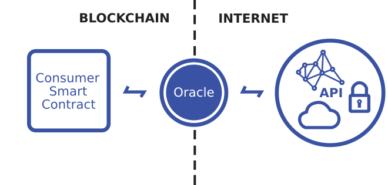

# {{$frontmatter.title}}

[[toc]]

A smart contract cannot access data that is not presently in the blockchain, which is commonly known as the Oracle problem. An oracle is an agent that acts as an intermediary between a smart contract platform and an API. In other words, a decentralized application can use an Oracle to call an off-chain API.

An Oracle consists of two parts.

* The Oracle node that acts as a proxy, i.e., listens for requests made on the blockchain, calls the API over the Web, fulfills the requests by making transactions on the blockchain. Note that the Oracle node is a traditional application that needs hosting.
* Smart contracts implement a protocol that defines how decentralized applications can make requests to the Oracle and receive responses. This part is deployed on-chain and runs trustlessly, i.e., no specific party needs to host it.

Based on this information, it looks like simply having an Oracle solves the API connectivity problem. However, there is an important point to consider. Who will host the Oracle node?
 
1. If an API Provider hosts the Oracle node, the Oracle is called a **First-Party Oracle**.
2. If a third-party middleman hosts the Oracle node, the Oracle is called a **Third-Party Oracle**.

*See the article, [First-Party vs Third-Party Oracles](https://medium.com/api3/first-party-vs-third-party-oracles-90356e3cffe5) for a comparison of the two types of Oracles.*

Third-Party Oracles are both insecure and expensive (see the <a href="../../api3-whitepaper.pdf" target="_whitepaper_pdf">API3 Whitepaper</a> for a detailed explanation). In contrast, First-Party Oracles are both secure and cost-efficient by not having a middleman on the interface path.
