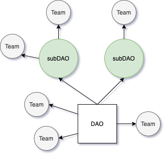

# {{$frontmatter.title}}

<TocHeader />
[[TOC]]

API3 is governed by a Decentralized Autonomous Organization, DAO. Its governance is entirely decentralized and open, meaning that all stakeholders will be able to participate in the governance of the project directly. This will be achieved through the API3 token, which when staked in the [DAO pool](dao-pool.md), will grant voting power in the DAO.

The DAO will vote on high-level matters such as staking incentives and collateralization. Additionally, the DAO will give out grants from the DAO bank and decide on the general direction of the project.

## DAO Structure

The DAO organizational structure is comprised of  hierarchical teams and subDAOs both of which manage, streamline and secure the success of the DAO.

### Hierarchical Teams

More granular tasks are conducted through hierarchical team structures for scalable governance.

The expected workflow is to form off-chain teams and apply for grants to execute one-time projects or continuous operations that will benefit the DAO. The team makes the grant application with a multisig that has the team members assigned as users, and the DAO grants the funds to the multisig if the grant proposal is accepted.

This team-based governance scheme is scalable in terms of gas costs, as it requires fewer proposals to be voted on at the DAO level. It is also more scalable in practical terms, as it does not require the constant attention of all governing parties to a wide variety of minute details. Furthermore, it allows critical operations such as dAPI management to be executed swiftly and based on expert opinion. As API3 operations scale up, this governance hierarchy may demand additional layers, which implies subDAOs.

To learn more about hierarchical team structures <a href="/api3-whitepaper-v1.0.1.pdf#AI3%20DAO" target="api3-docs">see Section 5.3 of the API3 Whitepaper</a>.

### subDAO

The DAO governs by selectively allocating funds and delegating authority. When a task reaches a scale that can no longer be fulfilled by a team, it is assigned to a subDAO.

> 

## Effectuation

The DAO focuses on two principles for its governing structure to be effective.

- Malicious Damage
- Transparency

### Malicious Damage

Firstly, to limit the amount of damage a malicious or incompetent team may cause, the authority that the team has must be constrained to a bare minimum, which is also known as the “principle of least privilege”. For example, a dAPI management team should never be able to completely recompose a dAPI that is under use, but should only be able to switch individual oracles in and out with a long enough cool-down period to ensure that their authority cannot be abused to a significant degree. Similarly, milestones and deliverables should be utilized to grant teams only the funds they need to carry out the specific responsibilities they have at the time. 

### Transparency

The second principle is transparency. For the DAO to be able to assess its performance, the team must report to the DAO in great detail. These reports will have the additional benefit of providing accountability and allow the dAPI users and the general public to be able to audit the operations of API3 at all times.

## Monetization

In general the industry standard for API provider subscription fees are commonly paid monthly or annually, as this scheme suits both API providers and their clients. API3 will aim to follow the same scheme for dAPIs.

### dAPI monetization

To gain access to a dAPI, the user will pay a recurring subscription fee, which may either be fixed or customized for the user based on the specific use case. These prices will be determined by the respective team, and will include the premium if the user wants to receive the [insurance service](dao-pool.md#insurance-service). The payment will be able to be made in any cryptocurrency, which will be received by the DAO in API3 tokens through a liquidity pool-based decentralized exchange.

### API provider compensation

API providers will be compensated periodically at fixed rates, which will fit their existing pricing models. This will be done using stablecoins wherever possible, some API providers categorically reject handling cryptocurrency as payment. In such cases, the DAO will provide a grant that will be paid out in return of the proof that the API provider is compensated in fiat by the grantee.
