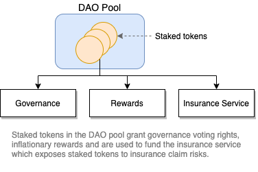
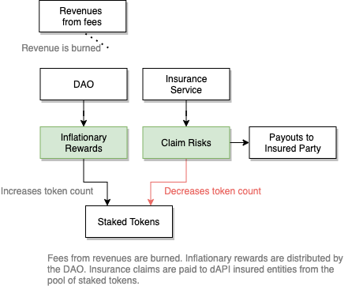
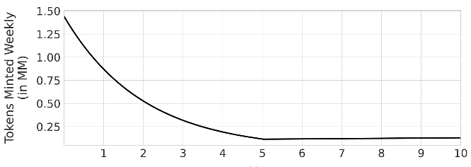

# {{$frontmatter.title}}

<TocHeader />
<TOC class="table-of-contents" :include-level="[2,3]" />

The API3 DAO has a single staking pool called the **DAO pool**. Staking API3 tokens in the pool will grant representation and staking rewards, but at the same time, the staked tokens will be used as collateral to pay out insurance claims as needed. To do this, the pool focuses on three token utilities and implements an insurance service which by design balances rewards and risks through responsible governance.

## Token Utilities

Decentralized governance requires well-balanced incentive mechanisms that accurately model both positive and negative outcomes. In other words, the governing entities should be rewarded for good results and penalized for bad ones. The API3 token is designed to facilitate this through three main utilities:

_Main utilities of the API3 token._

> 

1. [Staking](dao-pool.md#staking): Grants membership in the API3 DAO and rights to [inflationary rewards](dao-pool.md#inflationary-rewards).
1. [Collateral](dao-pool.md#collateral): Backs insurance services that protect users from damages caused
by dAPI malfunctions.
1. [Governance](dao-pool.md#governance): Grants direct representation in the API3 DAO.

Note that it is critical for these three utilities to coincide. All governing entities must receive staking rewards for them to govern in a way that maximizes revenue. All governing entities must have their funds used as collateral for them to govern in a way that minimizes **_security_** risks. "_Security_" refers to a "guarantee or reliability of dAPI service"

Reference <a href="/api3-whitepaper-v1.0.1.pdf#API3 tokenomics" target="api3-docs">section 5.6 _"API3 Tokenomics"_</a> of the API3 whitepaper.

### Staking

The staking utility incentivizes participation in the DAO and alignment of incentives. By [staking](tokens.md#staked-tokens) your API3 tokens into the DAO pool, you receive governance voting rights and take part in providing API3 users with quantifiable _security_ in the form of insurance. The DAO pool also grants you inflationary rewards and exposes you to insurance claim risks.

> 

**Benefits:**
- Generate shares (tokens) in the DAO through revenue sharing from the insurance service fees.
- Generates inflationary rewards by decreasing the circulating supply of API3 tokens through revenue burn from the insurance service fees.
- Improved token inflation protection compared to unstaked tokens.
- Voting privileges on DAO proposals.
  
**Risks:**
- Staked tokens in the DAO pool are used to cover potential financial losses from dAPI malfunctions that the dAPI consumer might incur.

To stake your tokens use the [Dashboard](dashboard/staking.md). You can stake as many times as you’d like. Your percentage of all the tokens in the DAO pool are directly related to your percentage of the rewards and the risks. If you stake 10% of the pool you earn 10% of rewards and will pay 10% of insurance claims.

### Collateral

The collateral utility has the participants share the DAO's operational risk and incentivizes them to minimize it.

If staking tokens only yielded rewards, the sole governance incentive would be to maximize the revenue. This would be done by increasing the number of dAPI users aggressively, and the amount that is secured by the dAPIs with it. Doing so puts excessive pressure on a dAPI which is more likely to malfunction due to an attack. Therefore, this is not a sustainable governance strategy for decentralized data feeds.

Exposing the governing parties to the risk would align their incentives with that of the DAO. The governing parties need to be penalized when a dAPI malfunction occurs using an onchain insurance service that provides dAPI users with quantifiable and trustless security guarantees. The [insurance service](dao-pool.md#insurance-service) uses staked tokens of the DAO pool as collateral, which means that when a dAPI malfunction is confirmed through the dispute resolution protocol, user damages will be covered from the pool's staked tokens.

Reference <a href="/api3-whitepaper-v1.0.1.pdf#Collateral" target="api3-docs">section 5.6.2 _"Collateral"_</a> of the API3 whitepaper.

### Governance

The governance utility gives the participants the ability to enact and manage staking and collateral.

The only way to gain representation in the DAO is to stake API3 tokens in the pool. Staked tokens give their holders the right to take part in the governance of the API3 ecosystem through the DAO. To vote token holders must stake their API3 tokens in the pool, which also gives them access to weekly staking rewards but also share in the risk of dAPI insurance.

All governing parties will be exposed to all risks and rewards of API3, and will govern to optimize them. Inflationary rewards and the staked tokens being used as collateral will create a positive feedback loop in terms of governance quality. Initial token holders will have to stake and expose themselves to risk if they do not want to lose value to inflation. If they misgovern and lose collateral through insurance claims, these tokens will get returned to the open market, from where they will be acquired by new governing parties. In contrast, if initial token holders govern well and cause token scarcity in the market, the representation distribution will be protected. In other words, governance tokens being used as collateral results in a robust Darwinian structure that improves itself and is able to recover from failures.

## Monetization

In general the industry standard for API provider subscription fees are commonly paid monthly or annually, as this scheme suits both API providers and their clients. API3 follows the same scheme for dAPIs.

### dAPI monetization

To gain access to a dAPI, a dApp will pay a recurring subscription fee, which may be fixed or customized for the dApp based on a specific use case. These prices will be determined by the respective team, and will include a premium if the dApp wants to receive the [insurance service](dao-pool.md#insurance-service). The payment can be made in any cryptocurrency, which will be received by the DAO in API3 tokens through a liquidity pool-based decentralized exchange.

### API provider compensation

API providers will be compensated periodically at fixed rates, which will fit their existing pricing models. This will be done using stablecoins wherever possible, some API providers categorically reject handling cryptocurrency as payment. In such cases, the DAO will provide a grant that will be paid out in return of the proof that the API provider is compensated in fiat by the grantee.

## Insurance Service

API3 provides dAPI users with a quantifiable level of _security_ in the form of an on-chain insurance service. Staked pool funds are used to cover potential financial losses from dAPI malfunctions that the dAPI consumer might incur. This accomplishes two goals.

- The insurance acts as a well-defined and trustless safety net in case of a dAPI malfunction.
- It holds the governing parties responsible for dAPI malfunctions, and thus incentivizes them to govern towards more secure dAPIs.

API3 co-developed an on-chain insurance service with Kleros that provides quantifiable and trustless _security_ to dAPI users. This insurance service will protect the dAPI user against damages caused by certain dAPI malfunctions up to a payout limit. Note that even if API3 did not provide this service, the dAPI user could have received on-chain insurance services using a third party solution. Such a solution would tend towards charging very high insurance premiums, as they would not have access to the information and expertise to accurately assess dAPI risks.

The proposed insurance service is special in the way that it is collateralized by the funds staked by the governing parties of the API3 DAO. Therefore, it not only provides _security_ to the dAPI user, but also creates a very strong incentive for dAPIs to be governed in a way that dAPI _security_ is maximized, which will further decrease insurance costs.

Reference <a href="/api3-whitepaper-v1.0.1.pdf#Insurance process" target="api3-docs">section 5.6 _"Insurance process"_</a> of the API3 whitepaper.

## Rewards and Risks

API3 aims to set up, maintain, and [monetize](#monetization) dAPIs at scale. Its success in doing so can be estimated by its total revenue, as this will increase with the number of dAPIs and the amount of funds secured by them. API3 generates revenue through subscription fees and insurance fees. The fees can be made in any cryptocurrency, which will be received by the DAO in API3 tokens through a liquidity pool-based decentralized exchange. To align the governance incentives with API3’s success, combined with the inflationary rewards, the net revenue to the DAO will result in burning of API3 tokens. This mechanic will produce positive staking incentives using inflationary rewards and claim risks rather than revenue sharing.

> 

### Inflationary Rewards

In essence, inflationary rewards force token holders to stake and preserve the value of
their tokens. However, staking is risky due to the funds being used as collateral, and
forces the staker to participate in governance to ensure that the risk is minimized. As a combination of the two, an inflationary governance token used as collateral forces all token holders to participate in
governance, which is ideal because it maximizes the decentralization of governance. Inflationary rewards are paid weekly by an implicit and automatic process through an on-chain contract. 
Furthermore, inflationary rewards are vested for a year, which results in governing
parties sharing the project’s long term interests.

The inflationary rewards start at a 75% annual rate (1.44% weekly), and the
number of tokens minted weekly will be decayed exponentially until annual inflation
rate becomes 2.5% at the end of year 5. From this point on, the annual inflation
will stay at a rate of 2.5% for perpetuity. The proposed inflation schedule will be governable.

> 

As a result the change in the total supply of API3 tokens is illustrated below.

> 

:::tip Inflationary Rewards
User X and Y both stake 500 API3 tokens, so each has 50% ownership in a 1000 token pool. For a particular week the reward payout is 1% (10 total tokens) and the pool is now 1010 tokens. X and Y now own 505 tokens each based on their 50% ownership.
:::

### Claim Risks

The staked tokens in the pool are used as collateral for insurance claims. Any payout results in the reduction of the total token count in the pool. The reduction is charged against each entity's percentage of tokens in the pool.

:::tip Claim Risks
User X and Y both stake 500 API3 tokens, so each has 50% ownership in a 1000 token pool. There is an insurance claim payout of 3.4 tokens and the pool is now 996.6 tokens. X and Y now own 498.3 tokens each based on their 50% ownership.
:::
