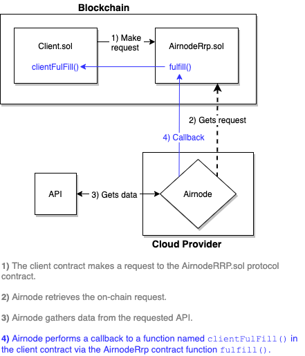

# {{$frontmatter.title}}

<TocHeader />
<TOC class="table-of-contents" :include-level="[2,3]" />


Client contracts that have been endorsed by a requester can call an Airnode. See [Become a Requester](become-a-requester.md) to set up a requester record and learn how to endorse a client contract.

Airnode is composed of two parts: the on-chain **AirnodeRrp.sol** protocol contract and the off-chain **Airnode Application** (cloud provider functions, e.g., AWS).

---
  >

  A client contract will make a request to the AirnodeRrp contract. When the request has been filled by the Airnode application it performs a  callback to the  **fulfill** function in the client contract via the AirnodeRrp contract.

See an [example contract](https://github.com/api3dao/airnode-starter/blob/main/contracts/ExampleClient.sol) in the Airnode Starter repo. 

## Step #1: Inherit AirnodeRrpClient.sol

To get started a client contract inherits from the [AirnodeRrpClient](https://github.com/api3dao/airnode/blob/master/packages/protocol/contracts/AirnodeRrpClient.sol) contract. This will expose the AirnodeRrp contract  functions to the client.

```solidity
import "@api3/airnode-protocol/contracts/AirnodeRrpClient.sol";

contract ExampleClient is AirnodeRrpClient {
  ...
  constructor (address airnodeAddress)
      public
      AirnodeClient(airnodeAddress)
  {}
  ...
}
```
Note the constructor parameter _airnodeAddress_ which is the public address of the AirnodeRrp contract on the blockchain you wish to use. It is used by AirnodeRrpClient to instantiate and point itself to the AirnodeRrp contract.


## Step #2: Make a Request

There are three types of requests provided by the AirnodeRrp contract for use by a client contract to make a request. See [Request Types](../technology/protocols/request-response/request.html#request-types) in the Technology section for information related to each request type. 

This example will use a _full request_ type (note the _makeFullRequest_ function in the code below) which is called from the client contract's own function _callTheAirnode_. The function _makeFullRequest_ requires the client contract pass all parameters needed by the Airnode application to call its underlying API.

```solidity
import "@api3/airnode-protocol/contracts/AirnodeRrpClient.sol";

contract ExampleClient is AirnodeRrpClient {
  mapping(bytes32 => bool) public incomingFulfillments;
  mapping(bytes32 => int256) public fulfilledData;

  constructor (address airnodeAddress)
      public
      AirnodeClient(airnodeAddress)
  {}

  function callTheAirnode(
      bytes32 airnodeId,
      bytes32 endpointId,
      uint256 requesterInd,
      address designatedWallet,
      bytes calldata parameters
      )
      external
  {
      bytes32 requestId = airnode.makeFullRequest( // Make the request 
          airnodeId,
          endpointId,
          requesterInd,
          designatedWallet,
          address(this),
          this.fulfill.selector,
          parameters
          );
      incomingFulfillments[requestId] = true;
  }
  ...
}
```
### Parameters

A _full request_ using the AirnodeRrp contract _makeFullRequest_ function requires all parameters needed by the Airnode application be passed at runtime. This is in contrast to a _regular or short request_ type that would use a template for some or all of the required parameters. See more about [templates](call-an-airnode.md#about-templates) below.

For the _full request_ the following parameters are required.

- airnodeId and endpointId specify the endpoint
- requesterIndex and designatedWallet specify which wallet will be used to fulfill the request
- fulfillAddress and fulfillFunctionId specify which method will be called to fulfill the request
- parameters specify the API and reserved parameters (see Airnode ABI specifications for how these are encoded)
#

For more details on these request see [Request Parameters](../technology/protocols/request-response/request.html#request-parameters) in the Technology section.

## AirnodeRrp Functions

Lorem Ipsum is simply dummy text of the printing and typesetting industry. Lorem Ipsum has been the industry's standard dummy text ever since the 1500s, when an unknown printer took a galley of type and scrambled it to make a type specimen book. It has survived not only five centuries, but also the leap into electronic typesetting, remaining essentially unchanged. It was popularised in the 1960s with the release of Letraset sheets containing Lorem Ipsum passages, and more recently with desktop publishing software like Aldus PageMaker including versions of Lorem Ipsum.

## About Templates


