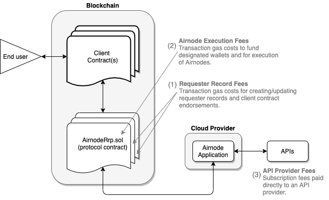

# {{$frontmatter.title}}

<TocHeader />
<TOC class="table-of-contents" :include-level="[2,3]" />

A requester will have three types of fees to consider.

1. Requester Record Fees: transaction gas costs to maintain a requester record and client contract endorsements.
2. Airnode Execution Fees: transaction gas costs incurred funding Airnode designated wallets and when executing  Airnodes.
3. API Provider Fees: subscriptions with API providers.

## Requester Record Fees

Fees are encountered when managing a requester's record, client contract endorsements and more. These are per call transaction gas costs and are relatively small. Funds will come from the wallet mnemonic that the requester supplies when calling certain [admin commands](../reference/cli-commands.html) as shown below. 

- [create-requester](../reference/cli-commands.md#create-requester)
- [set-requester-admin](../reference/cli-commands.md#set-requester-admin)
- [endorse-client](../reference/cli-commands.md#endorse-client)
- [unendorse-client](../reference/cli-commands.md#unendorse-client)
- [request-withdrawal](../reference/cli-commands.md#request-withdrawal)

## Airnode Fees

Fees are encountered, as transaction gas costs, when funding a requester's designated wallet for an Airnode and when executing the Airnode.

- [Funding](become-a-requester.md#part-3-funding-airnodes) a designated wallet.
- [Executing](../grp-requesters/call-an-airnode.md) an Airnode.

A designated wallet is funded manually by a requester using their preferred wallet management tool such as MetaMask.

When a client contract calls an Airnode there will be transaction gas costs that the requester usually covers. These funds will come from the designated wallet created by the Airnode (see [Funding Airnodes](become-a-requester.md#part-3-funding-airnodes)) on behave of a requester.

::: warning Designated Wallets are custodial
The requester should keep in mind that a designated wallet is custodial, i.e., the Airnode keeps the private key, and the funds are trusted with the Airnode. Therefore, a requester should not fund a designated wallet with more then they can trust the Airnode with.
:::

Requesters should not fund a designated wallet with more then they can trust the Airnode with. This risk becomes negligible when:

- The Airnode is a first-party oracle, because first-party oracles are trustworthy.
- The Airnode is being used for a high value use-case, which already implies a high level of trust.

If the requester does not trust the Airnode at all, they can fund the designated wallet just enough to cover a single fulfillment for each request. Therefore, this scheme both supports the traditional per-call payments, but also allows the protocol to leverage the trustworthiness of Airnodes to reduce unnecessary gas costs caused by microtransactions.

Although the designated wallet scheme allows the requester to cover the fulfillment gas costs of an Airnode, it is just as easy to have the API provider cover the gas costs. The only thing that needs to be done in this case is for the API provider to top up the designated wallet, instead of the requester. Furthermore, this scheme allows hybrid use-cases where the API provider covers the fulfillment gas costs for one requester (e.g., because they have made a special service agreement with them, while requires others to cover their own fulfillment gas costs.

## API Provider Fees

Some API providers charge a subscription fee to access their data. This is a typical practice and usually requires the requester to create an account on a website and then subscribe to a level of service offered. These types of services are usually billed monthly and can be based on an annual rate to save costs. The subscription (even if free) will most likely involve the use of a security scheme such as an api-key that must be used to access the data. See [Calling an Airnode](call-an-airnode.md) to learn more on how to pass the security credentials to an Airnode.

