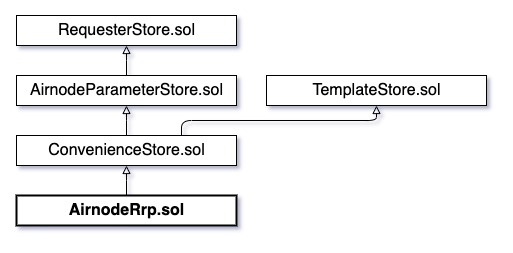

# {{$frontmatter.title}}

<TocHeader />
<TOC class="table-of-contents" :include-level="[2,3]" />

The first protocol implemented for Airnode is request–response.
An Airnode serving the request–response protocol listens for requests, makes the API call specified by the request, and fulfills the request as soon as possible.

## Contracts

The request–response protocol is implemented as a single permissionless contract that all Airnodes interact with, which is named `AirnodeRrp.sol`. This base contract has the following inheritance tree that compartmentalizes the aspects of the protocol.

  >  

<!--
```
AirnodeRrp.sol
└── Convenience.sol
    ├── TemplateStore.sol
    └── AirnodeParameterStore.sol
        └── RequesterStore.sol
```
-->

### AirnodeRrp.sol

[AirnodeRrp.sol](https://github.com/api3dao/airnode/blob/master/packages/protocol/contracts/AirnodeRrp.sol)

This contract sits between a client contract and the Airnode. It inherits from four additional contracts as illustrated in the diagram above.

- Used by clients to make requests.
- Used by Airnodes to fulfill requests.

To use AirnodeRrp.sol a client contract must import AirnodeClient.sol.

```
import "@api3/airnode-protocol/contracts/AirnodeClient.sol";
```

### Convenience.sol

[Convenience.sol](https://github.com/api3dao/airnode/blob/master/packages/protocol/contracts/Convenience.sol)

This contract is used by Airnodes to make batch-calls to `AirnodeRrp.sol`. For example, instead of making a separate static call to retrieve each template, an Airnode can use `Convenience.sol` to retrieve multiple templates with a single static call. In addition, Airnodes use this contract to check if a request is authorized according to endpoint authorizers.

### TemplateStore.sol

[TemplateStore.sol](https://github.com/api3dao/airnode/blob/master/packages/protocol/contracts/TemplateStore.sol)

- Used by requesters to store request templates.
- Used by Airnodes to retrieve request templates.

### AirnodeParameterStore.sol

[AirnodeParameterStore.sol](https://github.com/api3dao/airnode/blob/pre-alpha/packages/protocol/contracts/ProviderStore.sol)

- Used by an Airnode owner to manage parameter records.
- Used by requesters to retrieve the extended public keys of an Airnode to derive their designated wallet addresses.
- Used by requesters to request withdrawals from their designated wallets.
- Used by Airnodes to fulfill withdrawal requests.

### RequesterStore.sol

[RequesterStore.sol](https://github.com/api3dao/airnode/blob/master/packages/protocol/contracts/RequesterStore.sol)

- Used by requesters to create requester records.
- Used by requesters to endorse clients, which allows clients to make requests that will be fulfilled by the requesters' designated wallets.

## Concepts

::: tip
Click the links below for the page of the specific concept. It is recommended to read these in their given order.
:::

1. An [Airnode](airnode.md) serves one or more APIs to smart contracts.

1. Each of the API operations that the Airnode serves is accessible over an [endpoint](endpoint.md).
The Airnode sets [authorizers](authorizer.md) for these endpoints, which are contracts that implement authorization policies.

1. A [requester](requester.md) owns contracts that make requests to Airnodes. Each of these contracts is called a [client](client.md).

1. Each Airnode keeps a [designated wallet](designated-wallet.md) for each requester. The requester [endorses](endorsement.md) their clients allowing them to make requests that will be fulfilled by the requester's designated wallet.

1. A requester can create a request [template](template.md), which is an on-chain record that they can refer to while making [requests](request.md).

## @api3/airnode-admin

[`@api3/airnode-admin`](https://github.com/api3dao/airnode/tree/master/packages/admin) is a package and a CLI tool used to interact with `AirnodeRrp.sol` and perform administrative actions for the concepts mentioned above.
